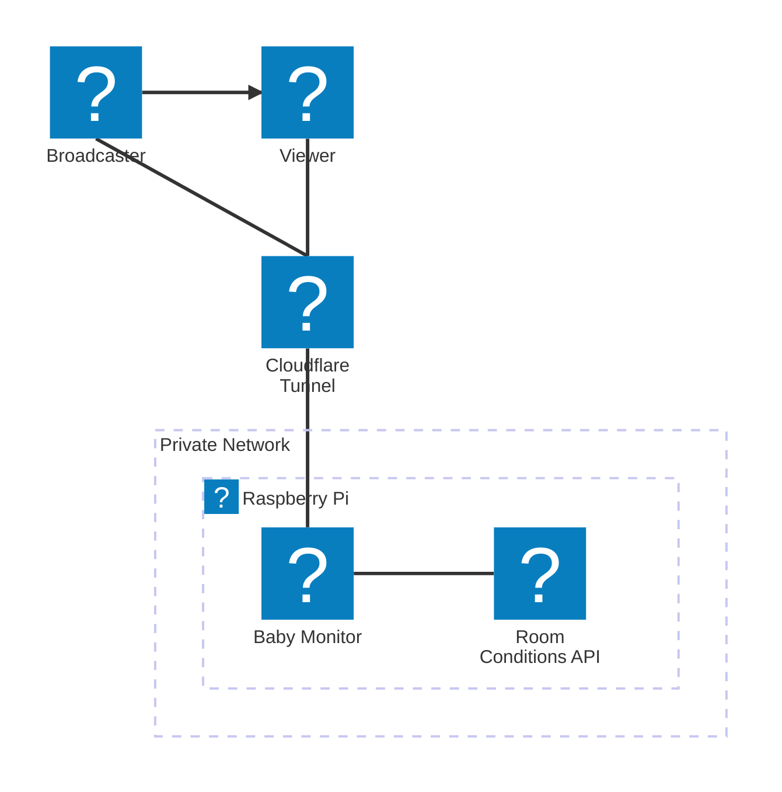

# 環境構成図

```mermaid
architecture-beta
    group private_network[Private Network]
    group raspberrypi(logos:raspberry-pi)[Raspberry Pi] in private_network

    service broadcaster(logos:chrome)[Broadcaster]
    service viewer(logos:chrome)[Viewer]
    service cloudflare_tunnel(logos-cloudflare-icon)[Cloudflare Tunnel]
    service baby_monitor(logos:express)[Baby Monitor] in raspberrypi
    service room_conditions_api(logos:flask)[Room Conditions API] in raspberrypi

    broadcaster:R --> L:viewer
    broadcaster:B -- T:cloudflare_tunnel
    viewer:B -- T:cloudflare_tunnel
    cloudflare_tunnel:B -- T:baby_monitor
    baby_monitor:R -- L:room_conditions_api
```
