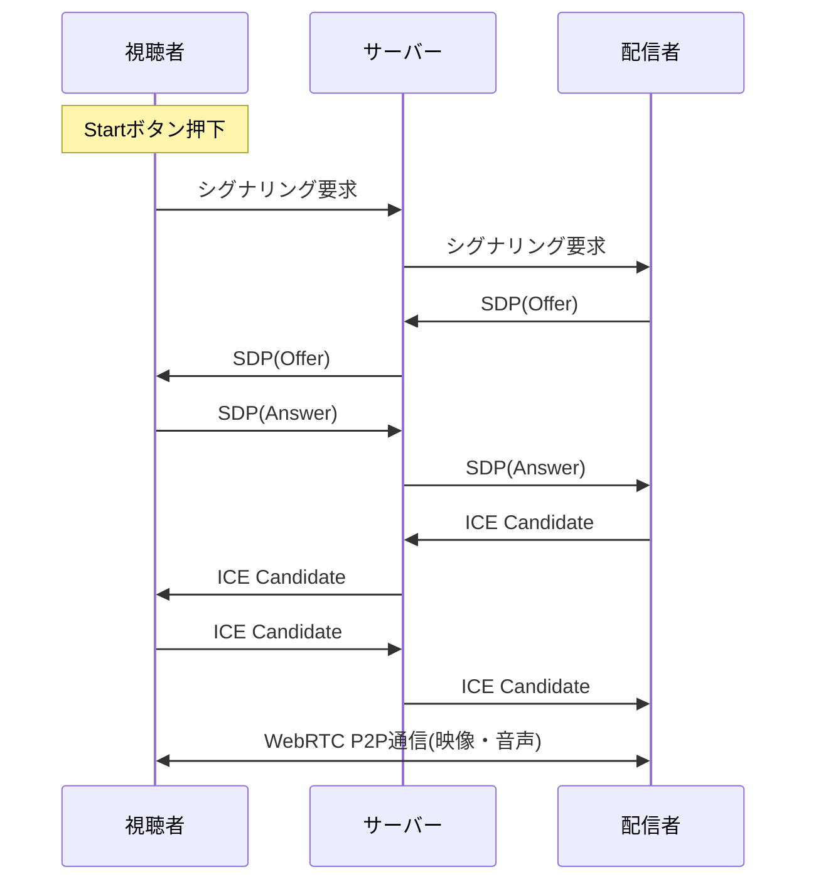

# 映像・音声配信について

## 使用した技術

- [WebRTC(Web Real-Time Communication)](https://developer.mozilla.org/ja/docs/Web/API/WebRTC_API)

## WebRTC関連の用語

- シグナリング  
  WebRTCでP2P接続を確立するために必要な情報（SDPやICE Candidate）を交換するプロセス。  
  シグナリング自体はWebRTCの仕様に含まれておらず、独自に実装する必要がある。
- SDP(Session Description Protocol)  
   WebRTCで、音声・映像などのメディアや通信の仕様を表すためのフォーマット。以下の情報を含む：

  - コーデックの種類（例：Opus、VP8、H.264など）
  - メディアの種類（音声・映像・データ）
  - 通信方向（送信のみ、受信のみ、双方向）
  - 暗号化方式や接続情報（IPアドレス・ポートなど）

  Offer/Answer という形式で相手と交換し、接続条件をすり合わせる。

- ICE Candidate(Interactive Connectivity Establishment Candidate)
  - 相手と接続するための具体的なネットワーク経路（IPアドレス・ポート）の候補情報  
    複数の候補が収集され、最適なルートが自動的に選択される

## P2P接続までのシーケンス図

